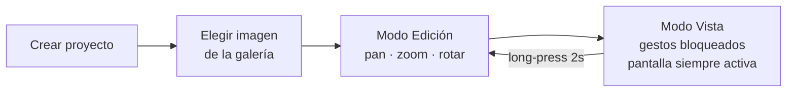

# Lumina

**Convierte tu tablet en una caja de luz digital para calcar y referenciar dibujos. 100% local, sin suscripciones.**


---

## El problema

Los artistas, ilustradores y diseñadores necesitan una **caja de luz** para calcar contornos, referenciar composiciones y practicar trazos. Las cajas de luz físicas son caras y las apps equivalentes suelen esconder funciones básicas tras suscripciones. **Lumina convierte cualquier tablet o móvil en una caja de luz profesional**: colocas el papel sobre la pantalla y calcas, sin cuotas ni conexión a internet.

---

## Cómo funciona



Decisiones técnicas clave y su porqué:

- **Reanimated + Gesture Handler** — los gestos de arrastrar, hacer zoom y rotar corren en el hilo de UI, así el ajuste de la imagen es fluido y sin lag mientras alineas.
- **Zustand** — estado global mínimo y sin boilerplate para gestionar proyectos y transformaciones de imagen.
- **AsyncStorage** — persistencia local en el dispositivo: tus proyectos siguen ahí al cerrar la app.
- **100% offline** — no hay backend ni cuentas; nada sale de tu dispositivo.

---

## Stack

| Capa | Tecnología |
|------|-----------|
| Framework | React Native + Expo |
| Estilos | NativeWind (Tailwind CSS) |
| Gestos y animaciones | Reanimated + Gesture Handler |
| Estado | Zustand |
| Persistencia | AsyncStorage |

---

## Uso

Lumina tiene dos modos:

- **Modo Edición** — alinea la imagen: arrastra con un dedo para moverla, pellizca para hacer zoom y gira con dos dedos. Pulsa *Reset* para centrarla de nuevo y *Done* para guardar.
- **Modo Vista** — pensado para calcar: la interfaz desaparece, los gestos se bloquean (nada se mueve sin querer) y la pantalla permanece siempre activa.

Para abrir el menú desde el Modo Vista, mantén pulsada la pantalla **2 segundos** (long-press): aparecerán los controles para volver, editar u ocultarlos.

---

## Instalar y actualizar

La app se distribuye como APK (Android). Instálala una vez y las actualizaciones llegan solas.

**Instalar (una vez):**

1. Abre la [página de builds](https://expo.dev/accounts/jfdg01/projects/lumina/builds) en el móvil y pulsa *Install*. O copia el APK que te pasen.
2. Android pide permiso para instalar desde el navegador. Acéptalo.

**Actualizaciones OTA (over the air):**

La app lleva `expo-updates`. Al arrancar, comprueba si hay una versión nueva del código en el canal `preview`, la descarga y la usa en el siguiente arranque. No hace falta reinstalar nada. Para forzar una actualización: cierra la app del todo (desliza en recientes) y ábrela dos veces.

**Publicar una actualización (desarrollador):**

```bash
npx eas-cli update --branch preview --message "qué cambia"
```

Esto solo sirve para cambios de JavaScript, estilos y assets. Un cambio nativo (módulo nuevo, permiso nuevo, subir de SDK) necesita un APK nuevo: sube `version` en `app.json` y ejecuta:

```bash
npx eas-cli build -p android --profile preview
```

---

## Ejecutar en local

```bash
npm install     # instala dependencias

npm start       # inicia el servidor de Expo
npm run android # abre en Android
npm run ios     # abre en iOS
npm run web     # abre en navegador
```

---

Código abierto (MIT) · 100% local · sin suscripciones.
